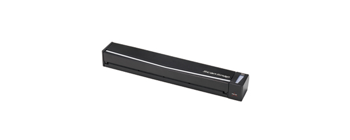

# Fujitsu ScanSnap S1100 Linux



The ScanSnap S1100 is a handy USB compact doc scanner which you can still get on ebay for about $50 in 2026.  On linux there is no Futitsu support, but thanks to linux community there are tools to make it work almost like the ScanSnap software which is actually very good despite constant updates. 

This code enables button scanning to PDF with brightness & contrast settings on Linux (Ubuntu 24+). When you press the physical scan button on the Fujitsu ScanSnap S1100, the scanner captures a page, adds it to a PDF, and opens it in a viewer. Feed pages one at a time and press the button for each; close the PDF viewer when done to start a new document next time.

## Features

- **Button-triggered scanning**: Press the scanner button to scan
- **Multi-page PDF**: Each button press adds a page; close the viewer to finalize
- **Brightness & contrast**: Scans use brightness=30, contrast=10 (adjustable in script)
- **Dynamic device detection**: Works even when the USB device number changes (e.g. after unplug)
- **User-independent**: Works for any user who runs the installer

## Prerequisites

- Fujitsu ScanSnap S1100 connected via USB
- Ubuntu 24.04 or compatible Linux
- S1100 firmware: the installer downloads it via wget from [stevleibelt/scansnap-firmware](https://github.com/stevleibelt/scansnap-firmware). If `~/scansnap-firmware` exists, its remote URL is used (for forks); otherwise the default GitHub project is used.

## Resources

- **[Fujitsu ScanSnap S1100](https://www.fujitsu.com/global/products/computing/peripheral/scanners/scansnap/s1100/)** — Official product page (specifications, features)
- **[ScanSnap Support](https://www.fujitsu.com/global/scanners/scansnap/g-support/en/)** — Drivers and ScanSnap Home software for **Windows** and **Mac** users

## Installation

```bash
cd fujitsu-s1100-linux
sudo ./install.sh
```

Or using make:

```bash
make install
```

## Uninstall

To revert all changes:

```bash
sudo ./install.sh --remove
# or
make uninstall
```

This removes scanbd, the scan-button script, S1100 firmware, and removes your user from the scanner group. It does **not** delete `~/Documents/scans` (your scanned documents).

The installer will:

1. Install dependencies: `scanbd`, `sane-utils`, `imagemagick`, `evince`, `wget`, `libnotify-bin`
2. Install S1100 firmware (`1100_0B00.nal`) via wget from the scansnap-firmware GitHub project
3. Add your user to the `scanner` group and create `~/Documents/scans` with correct ownership
4. Configure scanbd (user, group, fujitsu.conf, D-Bus policy)
5. Install `scan-button.sh` to `/usr/local/bin/` (mode 755)
6. Restart scanbd

**Note:** Log out and back in (or reboot) after installation so `scanner` group membership takes effect.

You will be prompted to confirm before installation proceeds.

## Testing

### 1. Check scanbd status

```bash
systemctl status scanbd
```

Should show `active (running)`.

### 2. Monitor scanbd while testing

In a terminal, run:

```bash
sudo journalctl -u scanbd -f
```

This shows scanbd log output in real time.

### 3. Press the scan button

With the scanner connected and journalctl running:

1. Load a page into the scanner
2. Press the physical scan button
3. In journalctl you should see:
   ```
   scanbd: trigger action for scan for device epjitsu:libusb:003:XXX with script /usr/local/bin/scan-button.sh
   ```
4. A PDF should open in Evince
5. Add more pages by pressing the button again
6. Close Evince when done; the next button press starts a new document

### 4. Troubleshooting

| Symptom | Check |
|--------|-------|
| "Scanner not found" | Ensure scanner is powered on and connected. Run `scanimage -L` to list devices. Ensure firmware is installed: `ls /usr/share/sane/epjitsu/1100_0B00.nal`. If missing, re-run the installer (it downloads via wget). |
| scanbd fails to start | Check `journalctl -u scanbd`. Often fixed by the installer (fujitsu.conf, D-Bus policy). |
| Button press does nothing | Verify scanbd is running and watch `journalctl -u scanbd -f` for errors. |
| "Cannot open display" | The script auto-detects your display. Ensure you're logged into a graphical session (not SSH-only). Re-run the installer to deploy the fix. The PDF is still saved; if notify-send fails too, the path is written to `~/Documents/scans/.last-scan`. |
| Permission denied | Ensure user is in `scanner` group. Log out and back in after install. |

## How the script works

1. **Session detection**: A file `~/.scan-session` tracks whether you are adding pages to an existing document or starting a new one.
2. **First press**: Creates a timestamped PDF, opens it in Evince, and watches for Evince to close.
3. **Subsequent presses**: Appends the new page to the current PDF and regenerates it.
4. **Evince closed**: Session is cleared; the next button press starts a new document.

Scans are saved under `~/Documents/scans/` with filenames like `scan_20260301_170910.pdf`.

## Adjusting brightness and contrast

The script uses `--brightness=30` and `--contrast=10` by default. To change these:

1. Edit the script. If modifying the installed copy:
   ```bash
   sudo nano /usr/local/bin/scan-button.sh
   ```
   Or edit `scan-button.sh` in this repo and re-run the installer.

2. Find the `scanimage` lines (there are two: one for new sessions, one for adding pages) and change the values:
   ```bash
   --brightness=30 --contrast=10
   ```

3. Valid range for both options: **-127 to 127** (default is 0). Increase brightness for lighter scans; increase contrast for more defined blacks and whites.

4. If you edited `/usr/local/bin/scan-button.sh` directly, no restart is needed—changes apply on the next button press. If you edited the repo and re-ran the installer, the updated script is already deployed.

## License

MIT
